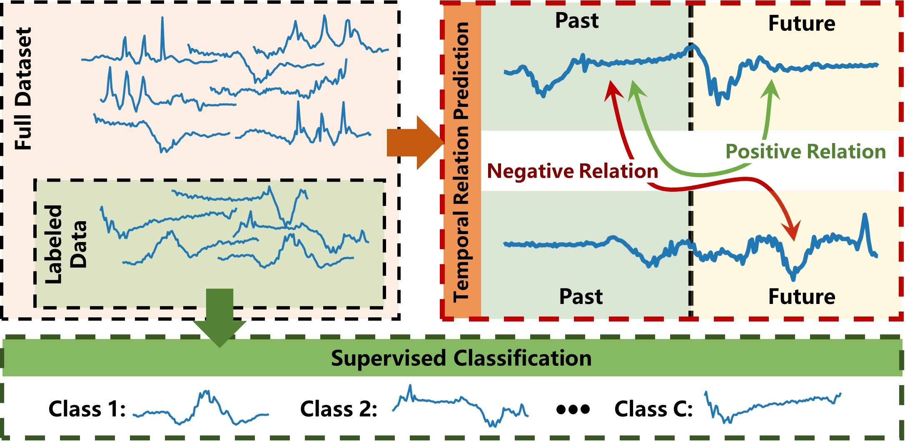
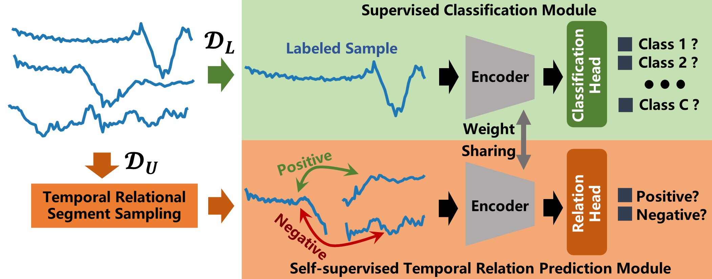

# Semi-supervised Time Series Classification by Temporal Relation Prediction (ICASSP 2021)





**Abstract:** Semi-supervised learning (SSL) has proven to be a powerful algorithm in different domains by leveraging unlabeled data to mitigate the reliance on the tremendous annotated data. However, few efforts consider the underlying temporal relation structure of unlabeled time series data in the semi-supervised learning paradigm. In this work, we propose a simple and effective method of Semi-supervised Time series classification architecture (termed as SemiTime) by gaining from the structure of unlabeled data in a self-supervised manner. Specifically, for the labeled time series, SemiTime conducts the supervised classification directly under the supervision of the annotated class label. For the unlabeled time series, the segments of past-future pair are sampled from time series, where two segments of pair from the same time series candidate are in positive temporal relation, while two segments from the different candidates are in negative temporal relation. Then, the temporal relation between those segments is predicted by SemiTime in a self-supervised manner. Finally, by jointly classifying labeled data and predicting the temporal relation of unlabeled data, the useful representation of unlabeled time series can be captured by SemiTime. Extensive experiments on multiple real-world datasets show that SemiTime consistently outperforms the state-of-the-arts, which demonstrates the effectiveness of the proposed method.


## Requirements

* Python 3.6
* PyTorch version 1.4


## Run Model Training and Evaluation


**Supervised**:
```bash
python main.py --dataset_name CricketX --model_name SuperCE
```

**SemiTime**:
```bash
python main.py --dataset_name CricketX --model_name SemiTime
```


## Check Results
After runing model training and evaluation, the checkpoints of the trained model are saved in the local [ckpt] directory, and all experimental results are saved in the local [results] directory.


### Cite
If you make use of this code in your own work, please cite our paper.
```
@inproceedings{fan2021semitime,
  title        = {Semi-supervised Time Series Classification by Temporal Relation Prediction},
  author       = {Haoyi Fan, Fengbin Zhang, Ruidong Wang, Xunhua Huang, and Zuoyong Li},
  booktitle    = {46th International Conference on Acoustics, Speech, and Signal Processing},
  year         = {2021},
  organization={IEEE}
}
```